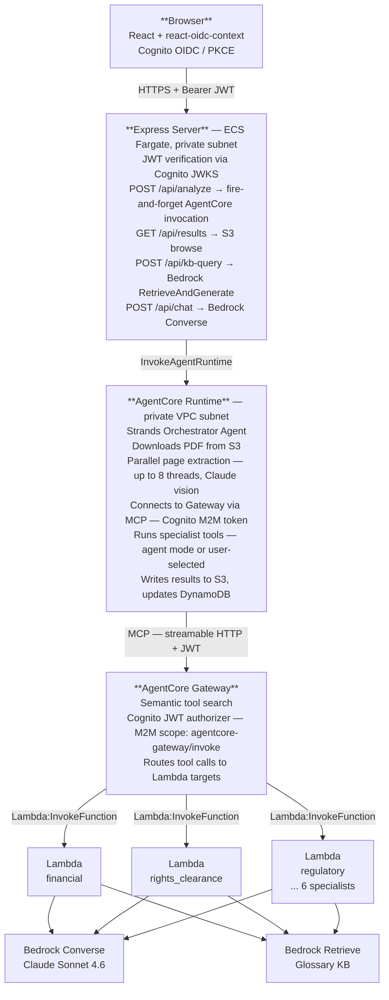
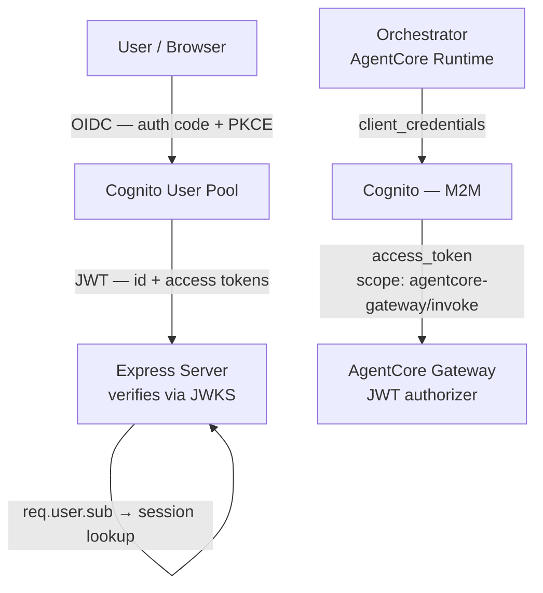

# Architecture

[← Home](../../README.md) | [Agents & Prompting](AGENTS.md) | [Deployment](DEPLOYMENT.md) | [Authentication](AUTHENTICATION.md) | [UI](UI.md) | [Local Dev](LOCAL_DEV.md)

---

## System Overview

The system has two runtime paths: a **deployed cloud path** (AgentCore Runtime + Lambda) and a **local path** (`run_pipeline.py` + `utils/orchestrator.py`). Both share the same prompt files and specialist logic.

---

## Component Map



---

## Data Flow

### Contract Submission

1. User selects a contract from the S3 source browser or uploads one
2. Browser sends `POST /api/analyze` with `{ contract_path, job_id }`
3. Express reads user session (enabled specialists, agent mode flag)
4. Express calls `InvokeAgentRuntime` — fire and forget
5. Express opens SSE stream, polls DynamoDB every 2s, streams progress to browser

### Orchestrator Pipeline

1. Download PDF from S3 to temp file
2. Render PDF pages to images (128 DPI, JPEG)
3. Parallel extraction: each page → Claude vision → XML extraction text
4. Concatenate page extractions into full extraction document
5. Upload `extraction.txt` to S3
6. Fetch Cognito M2M token from Secrets Manager
7. Connect to Gateway as MCP client
8. Run Strands agent with extraction + tool list
9. Agent calls specialist tools (parallel where domains are independent)
10. Upload `final-executive-summary.md` to S3
11. Update DynamoDB orchestrator record to `COMPLETE`
12. Emit CloudWatch metrics

### Specialist Lambda (per specialist)

1. Receive `{ job_id, extraction, s3_prefix, results_bucket }` from Gateway
2. Update DynamoDB to `RUNNING`
3. **Call 1** — `Converse`: identify key domain terms to look up
4. **Call 2** — `Retrieve`: query glossary KB with those terms (10 results)
5. **Call 3** — `Converse`: full analysis with extraction + glossary context injected
6. Upload `specialists/{name}.xml` to S3
7. Update DynamoDB to `COMPLETE`

---

## Storage Layout

```
s3://media-contracts-config-{id}-{sfx}/
├── prompts/
│   ├── foundation/          # Shared foundation XML prompt files
│   ├── agents/{name}/       # Per-specialist XML prompt files
│   └── main-agent.xml       # UI chat system prompt
└── schemas/
    └── specialists/         # MCP tool schemas for Gateway

s3://media-contracts-source-{id}-{sfx}/
├── testing/{cognito-sub}/   # Per-user uploads from the UI
└── pipeline/                # PDFs dropped here auto-trigger the pipeline

s3://media-contracts-results-{id}-{sfx}/
└── {contract_name}_{timestamp}/
    ├── extraction.txt
    ├── specialists/
    │   ├── financial.xml
    │   ├── rights_clearance.xml
    │   └── ...
    ├── final-executive-summary.md
    └── timings.json

s3://media-contracts-terms-{id}-{sfx}/
└── {glossary files}         # Industry term definitions for Terms KB

DynamoDB: media-contracts-jobs-{id}-{sfx}
  PK: job_id  SK: specialist
  status: PENDING | RUNNING | COMPLETE | FAILED
  result_s3_key, started_at, completed_at, error, retry_count, ttl
  GSI: status-index (PK: status, SK: started_at)
```

---

## Auth Architecture



Two Cognito app clients:
- **UI client** — public, PKCE, scopes: openid/email/profile
- **Gateway client** — confidential, client credentials, scope: agentcore-gateway/invoke

Gateway credentials stored in Secrets Manager, fetched by orchestrator at runtime with a 60-second expiry buffer.

---

## Networking

All compute runs in private subnets. Outbound traffic routes through:
- **VPC endpoints** (S3, DynamoDB, Bedrock, SSM, Secrets Manager) — no NAT cost for AWS service calls
- **NAT gateway** — for anything else (e.g. Cognito token endpoint)

Security group on AgentCore runtimes: HTTPS egress only, no inbound.

---

## Observability

- **X-Ray** — active tracing on Lambda functions and AgentCore Runtime; `job_id`, `specialist`, `status` annotations enable cross-service trace correlation
- **CloudWatch** — custom namespace `MediaContracts/Pipeline` with metrics: `JobDuration`, `JobCompleted`, `JobFailed`, `EstimatedCostUSD`, `SpecialistsInvoked` (all dimensioned by `Mode: agent|user`)
- **Dashboard** — `MediaContracts-{id}` CloudWatch dashboard with job health, specialist performance, throughput, and cost rows
- **Alarms** — per-specialist error rate alarms + orchestrator error alarm + DynamoDB throttle alarm

---

## Cost Tracking

All Bedrock calls go through Application Inference Profiles, enabling per-application cost attribution in Cost Explorer. Four profiles: Sonnet 4.6, Opus 4.6, Sonnet 4.5, Haiku 4.5. Profile ARNs are injected as environment variables and resolved at runtime in `bedrock_client.py`.
