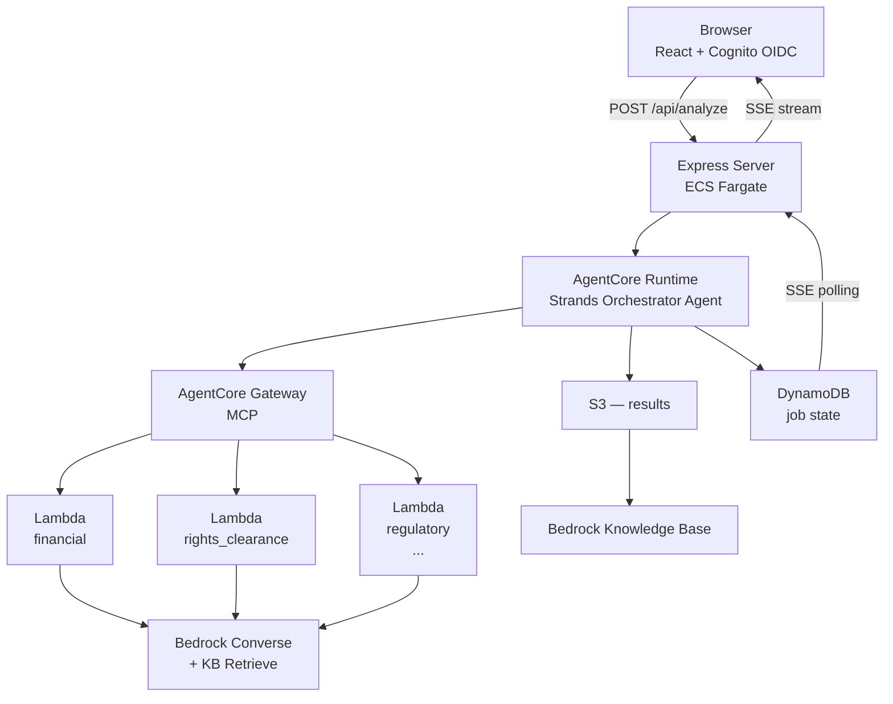

# Media Contracts Analyzer

AI-powered media contract review system. Uploads a contract PDF, runs it through a pipeline of domain-specialist AI agents, and produces grounded analysis with glossary-verified findings and an executive summary.

> Derived from [aws-samples/sample-badgers](https://github.com/aws-samples/sample-badgers).

---

## Documentation

### Getting Started

| Document                                                  | Description                                             |
| --------------------------------------------------------- | ------------------------------------------------------- |
| [Deployment](.github/documentation/DEPLOYMENT.md)         | CDK stacks, deploy sequence, environment variables      |
| [Authentication](.github/documentation/AUTHENTICATION.md) | Create users, assign groups, MFA setup, troubleshooting |
| [Local Development](.github/documentation/LOCAL_DEV.md)   | Running locally, env setup, testing                     |

### Using the System

| Document                                                                    | Description                                      |
| --------------------------------------------------------------------------- | ------------------------------------------------ |
| [UI Guide](.github/documentation/UI.md)                                     | Express server, React components, API routes     |
| [Upload & Pipeline Flow](.github/documentation/UPLOAD_AND_PIPELINE_FLOW.md) | S3 upload, presigned URLs, auto-trigger pipeline |

### How It's Built

| Document                                                               | Description                                                 |
| ---------------------------------------------------------------------- | ----------------------------------------------------------- |
| [Architecture](.github/documentation/ARCHITECTURE.md)                  | System design, component relationships, data flow           |
| [Agents & Prompting](.github/documentation/AGENTS.md)                  | Orchestrator, specialists, KB grounding, prompt system      |
| [MCS Schema](schemas/base/README.md)                                   | Media Contracts Schema v1.0 — standardized response format  |
| [Vision LLM Theory](.github/documentation/VISION_LLM_THEORY_README.md) | Why vision models outperform OCR for document understanding |

---

## How It Works

A user uploads a contract PDF through the web UI. The system:

1. **Extracts** — vision-based page-by-page extraction using Claude (parallel across pages)
2. **Analyzes** — domain specialists (financial, rights clearance, talent/guild, regulatory, risk) each run a grounded analysis: identify terms → retrieve glossary definitions → produce verified findings
3. **Synthesizes** — risk strategist produces a cross-cutting risk assessment and negotiation roadmap
4. **Summarizes** — executive summary written for a non-lawyer audience

Results are stored in S3, ingested into a Bedrock Knowledge Base, and browsable in the UI. Users can ask follow-up questions via KB chat.

---

## Architecture Overview



---

## Tech Stack

| Layer              | Technology                                                                                                                                                                                                 |
| ------------------ | ---------------------------------------------------------------------------------------------------------------------------------------------------------------------------------------------------------- |
| Agent framework    | [Strands Agents](https://github.com/strands-agents/sdk-python)                                                                                                                                             |
| Agent hosting      | [Amazon Bedrock AgentCore Runtime](https://docs.aws.amazon.com/bedrock/latest/userguide/agentcore-runtime.html)                                                                                            |
| Tool gateway       | [Amazon Bedrock AgentCore Gateway](https://docs.aws.amazon.com/bedrock/latest/userguide/agentcore-gateway.html) (MCP)                                                                                      |
| Foundation model   | Claude Sonnet 4.6 via [Amazon Bedrock Application Inference Profiles](https://docs.aws.amazon.com/bedrock/latest/userguide/inference-profiles-create.html)                                                 |
| Specialist compute | [AWS Lambda](https://docs.aws.amazon.com/lambda/latest/dg/welcome.html) (Python 3.12)                                                                                                                      |
| Storage            | [Amazon S3](https://docs.aws.amazon.com/AmazonS3/latest/userguide/Welcome.html) (config, source PDFs, results)                                                                                             |
| Job state          | [Amazon DynamoDB](https://docs.aws.amazon.com/amazondynamodb/latest/developerguide/Introduction.html)                                                                                                      |
| Knowledge base     | [Amazon Bedrock Knowledge Bases](https://docs.aws.amazon.com/bedrock/latest/userguide/knowledge-base.html) with [Amazon S3 Vectors](https://docs.aws.amazon.com/AmazonS3/latest/userguide/s3-vectors.html) |
| Auth               | [Amazon Cognito](https://docs.aws.amazon.com/cognito/latest/developerguide/what-is-amazon-cognito.html) (OIDC + M2M client credentials)                                                                    |
| Frontend           | React + Express on [Amazon ECS Express Mode](https://docs.aws.amazon.com/AmazonECS/latest/developerguide/express-service-overview.html)                                                                    |
| IaC                | [AWS CDK](https://docs.aws.amazon.com/cdk/v2/guide/home.html) (Python)                                                                                                                                     |
| Observability      | [Amazon CloudWatch](https://docs.aws.amazon.com/AmazonCloudWatch/latest/monitoring/WhatIsCloudWatch.html), [AWS X-Ray](https://docs.aws.amazon.com/xray/latest/devguide/aws-xray.html)                     |

---

## Quick Start

### Prerequisites

- AWS CLI configured
- Python 3.12+, [uv](https://docs.astral.sh/uv/)
- Node.js 20+
- Docker (running)
- AWS CDK v2 (`npm install -g aws-cdk`)

### Deploy

```bash
# Interactive deployment menu
DEPLOYMENT_ID=dev ./deploy.sh

# Or run a specific step non-interactively (e.g. step 9 = full deploy)
DEPLOYMENT_ID=dev ./deploy.sh 9
```

`deploy.sh` is an interactive menu with 8 resumable steps: foundational infra, prompt upload, specialists, gateway, orchestrator build/deploy, supporting stacks, UI build, and ECS deploy. State is tracked in `.deploy-state/` so you can resume after failures. See [Deployment](.github/documentation/DEPLOYMENT.md) for details.

### Run Locally

```bash
cp ui/.env.example ui/config/.env
# edit ui/config/.env with your deployed stack outputs
cd ui && npm install && npm run dev
```

See [Local Development](.github/documentation/LOCAL_DEV.md) for details.

---

## Media Contracts Schema (MCS) v1.0

All analyzer responses conform to the **Media Contracts Schema (MCS) v1.0** - a standardized XML format that ensures consistency while allowing domain-specific analysis.

### Key Features

- **7 Modular Parts**: Envelope, metadata, common spine, topical analysis, specialized sections, findings, and tags
- **Consistent Structure**: All analyzers share standard envelope and metadata
- **Flexible**: Each analyzer includes only relevant parts (e.g., document analyzers include common_spine, specialists include findings)
- **Validated**: Automated validation tool ensures conformance
- **Versioned**: Schema version tracking for evolution

### Quick Reference

| Analyzer                    | Type       | MCS Parts        |
| --------------------------- | ---------- | ---------------- |
| **extractor**               | Document   | 1, 2, 3, 4, 5, 7 |
| **handwriting_analyzer**    | Hybrid     | 1, 2, 3, 4, 5, 7 |
| **financial**               | Specialist | 1, 2, 5, 6, 7    |
| **rights_clearance**        | Specialist | 1, 2, 5, 6, 7    |
| **regulatory_compliance**   | Specialist | 1, 2, 5, 6, 7    |
| **talent_guild_compliance** | Specialist | 1, 2, 5, 6, 7    |
| **risk_strategist**         | Specialist | 1, 2, 5, 7       |

### Validation

Validate all format files:
```bash
python3 schemas/base/validate_mcs.py media_contracts_agents/
```

**Documentation**: See [schemas/base/README.md](schemas/base/README.md) for complete MCS documentation.

---

## Repository Structure

```
├── agentcore/
│   ├── orchestrator/          # Strands orchestrator agent (AgentCore Runtime container)
│   ├── specialist_lambda/     # Shared Lambda handler for all specialists
│   ├── specialists/           # Specialist-specific logic modules
│   ├── auto_trigger/          # S3 event → Lambda → auto-start pipeline
│   ├── kb_sync/               # S3 event → Lambda → KB ingestion trigger
│   └── shared/                # Bedrock client, DynamoDB job state, tracing, metrics
├── deployment/
│   ├── app.py                 # CDK app entry point (18 stacks)
│   ├── stacks/                # One file per CDK stack
│   ├── scripts/               # Build, env generation, prompt sync helpers
│   └── glossaries/            # Glossary definitions for Terms KB
├── media_contracts_agents/    # XML prompt files (foundation + per-specialist)
│   ├── foundation/            # Shared foundation XML prompts
│   ├── extractor/             # Contract extraction analyzer (MCS v1.0)
│   ├── financial/             # Financial analysis specialist (MCS v1.0)
│   ├── handwriting_analyzer/  # Handwriting transcription (MCS v1.0)
│   ├── regulatory_compliance/ # Regulatory compliance specialist (MCS v1.0)
│   ├── rights_clearance/      # Rights & clearances specialist (MCS v1.0)
│   ├── risk_strategist/       # Cross-cutting risk assessment (MCS v1.0)
│   └── talent_guild_compliance/ # Guild/union compliance specialist (MCS v1.0)
├── schemas/
│   └── base/                  # Media Contracts Schema (MCS) v1.0 base definitions
├── ui/
│   ├── server/                # Express API server
│   └── src/                   # React components
├── utils/                     # Shared utilities (prompt loader, PDF→images, orchestrator)
└── .github/documentation/     # All detailed documentation
```
---
This library is licensed under the MIT-0 License. See the LICENSE file.