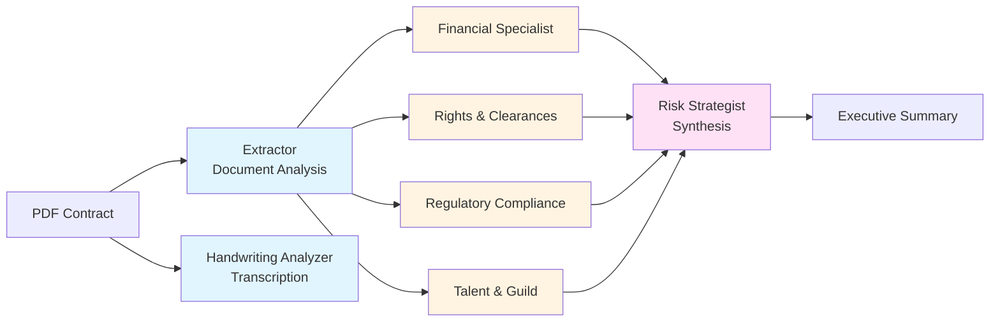

# Media Contract Analyzers

All contract analysis agents conforming to **Media Contracts Schema (MCS) v1.0**.

## Overview

This directory contains XML format specifications for 7 specialized contract analyzers. Each analyzer produces structured output following the MCS standard, enabling consistent processing while allowing domain-specific analysis.

## Analyzers

### Document Analyzers

| Analyzer | Purpose | MCS Parts | Documentation |
|----------|---------|-----------|---------------|
| **[extractor](extractor/)** | Initial contract extraction - produces structured content for downstream specialists | 1, 2, 3, 4, 5, 7 | [README](extractor/README.md) |
| **[handwriting_analyzer](handwriting_analyzer/)** | Transcribes handwritten annotations, amendments, and signatures | 1, 2, 3, 4, 5, 7 | [README](handwriting_analyzer/README.md) |

**Document analyzers** produce text extraction/transcription with **common_spine** (Part 3) for document reconstruction.

### Specialist Analyzers

| Analyzer | Purpose | MCS Parts | Documentation |
|----------|---------|-----------|---------------|
| **[financial](financial/)** | Financial term analysis, revenue waterfalls, economic risk | 1, 2, 5, 6, 7 | [README](financial/README.md) |
| **[rights_clearance](rights_clearance/)** | Rights grants, territory/platform scope, clearance status | 1, 2, 5, 6, 7 | [README](rights_clearance/README.md) |
| **[regulatory_compliance](regulatory_compliance/)** | Regulatory obligations, accessibility, data protection | 1, 2, 5, 6, 7 | [README](regulatory_compliance/README.md) |
| **[talent_guild_compliance](talent_guild_compliance/)** | Guild/union compliance, residuals, performer rights | 1, 2, 5, 6, 7 | [README](talent_guild_compliance/README.md) |
| **[risk_strategist](risk_strategist/)** | Cross-cutting risk synthesis and negotiation strategy | 1, 2, 5, 7 | [README](risk_strategist/README.md) |

**Specialist analyzers** perform domain-specific analysis with **findings** (Part 6) containing risks, gaps, and cross-references.

## MCS Parts Reference

All analyzers implement these modular parts:

| Part | Name | Description | Required For |
|------|------|-------------|--------------|
| **1** | Envelope | Root element with analyzer ID, schema version, job ID, timestamp | All |
| **2** | Core Metadata | Standard metadata (analyzer name, timestamp, confidence, element count) | All |
| **3** | Common Spine | Ordered text elements for document reconstruction | Document analyzers |
| **4** | Topical Analysis | High-level topic summary | Optional |
| **5** | Specialized | Domain-specific analysis structure (unique per analyzer) | All |
| **6** | Findings | Risks, gaps, ambiguities, cross-references | Specialist analyzers |
| **7** | Tags | Topical categorization tags | All |

## Validation

Validate all analyzer formats:

```bash
python3 ../schemas/base/validate_mcs.py .
```

Validate single analyzer:

```bash
python3 ../schemas/base/validate_mcs.py financial/financial_format.xml
```

## Format Files

Each analyzer directory contains:

- **`{analyzer}_format.xml`** - Complete XML format specification with inline documentation
- **`README.md`** - Analyzer purpose, MCS implementation details, output examples

## Analysis Pipeline



## Adding a New Analyzer

1. **Determine type**: Document or Specialist
2. **Choose MCS parts**: See [Implementation Matrix](../schemas/base/IMPLEMENTATION_MATRIX.md)
3. **Create format file**: `{analyzer}_format.xml`
4. **Add MCS reference**: Include MCS comment in header
5. **Implement required parts**:
   - Part 1: Envelope with proper attributes
   - Part 2: Core metadata + analyzer-specific fields
   - Part 5: Specialized section with your analysis structure
   - Part 6: Findings (if specialist)
   - Part 7: Tags
6. **Validate**: `python3 ../schemas/base/validate_mcs.py your_format.xml`
7. **Document**: Create README explaining your analyzer

## Schema Documentation

- **[MCS Base Schema](../schemas/base/README.md)** - Complete MCS v1.0 documentation
- **[Quick Start Guide](../schemas/base/QUICKSTART.md)** - Quick reference and examples
- **[Implementation Matrix](../schemas/base/IMPLEMENTATION_MATRIX.md)** - Which parts each analyzer uses
- **[Validation Tool](../schemas/base/validate_mcs.py)** - Python validator for conformance

## Current Status

All 7 analyzers are MCS v1.0 compliant and pass validation:

```
✅ extractor_format.xml
✅ handwriting_format.xml
✅ financial_format.xml
✅ rights_format.xml
✅ regulatory_format.xml
✅ talent_format.xml
✅ risk_format.xml

Summary: 7/7 files valid
```

**Last validated**: April 26, 2026
**Schema version**: MCS v1.0

## Questions?

See individual analyzer README files or the [MCS documentation](../schemas/base/README.md) for detailed information.
